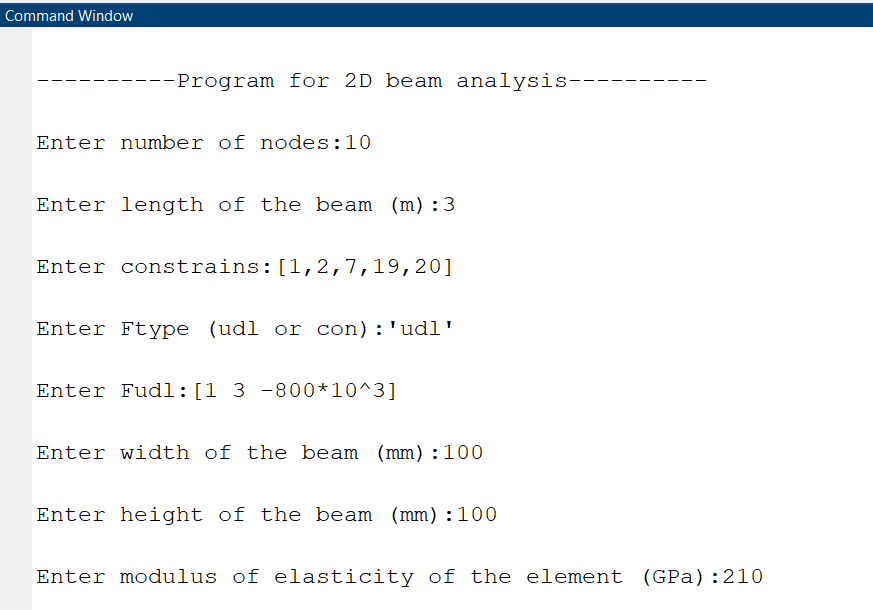
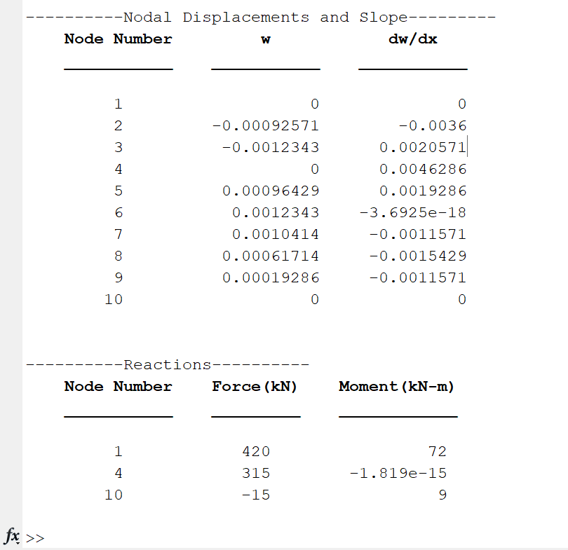
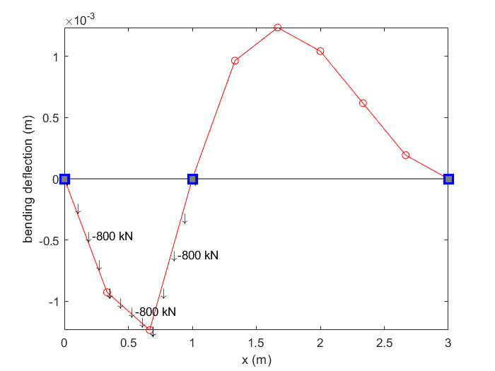
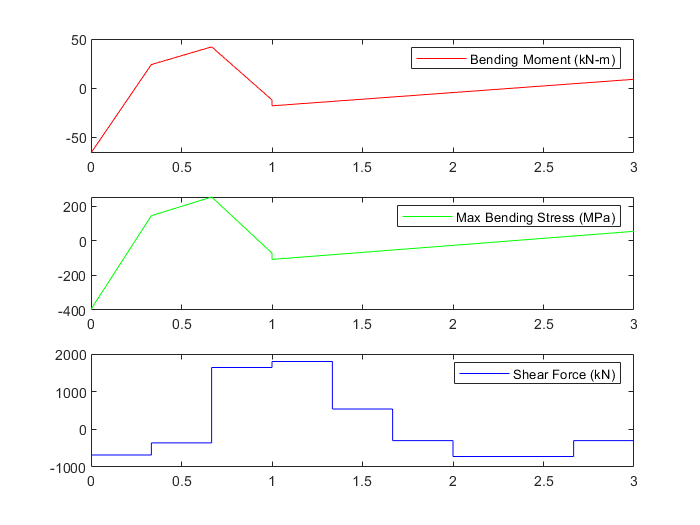
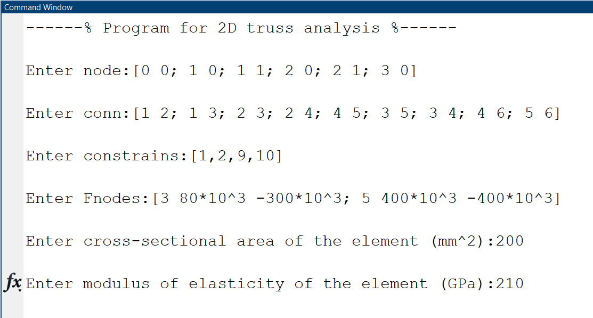
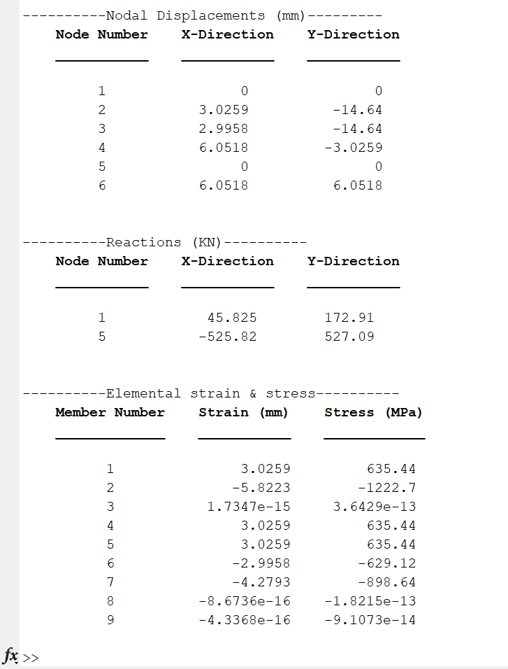

# MEL-420 Finite Element Method
Some MATLAB Code that I wrote during the academic course for doing structural analysis using FEM

- [x] 1D Beam problem
- [x] 2D Truss problem
  - [ ] Graphics visualization 
- [ ] 1D Rod problem
- [ ] 2D Beam problem

## 1D Beam example

### Input

### Output

## 2D Truss example

### Input

### Output

